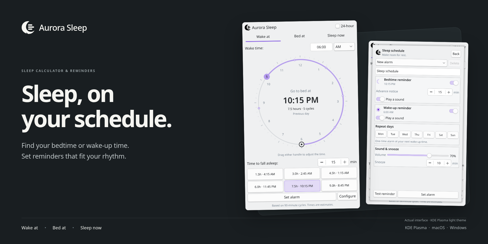
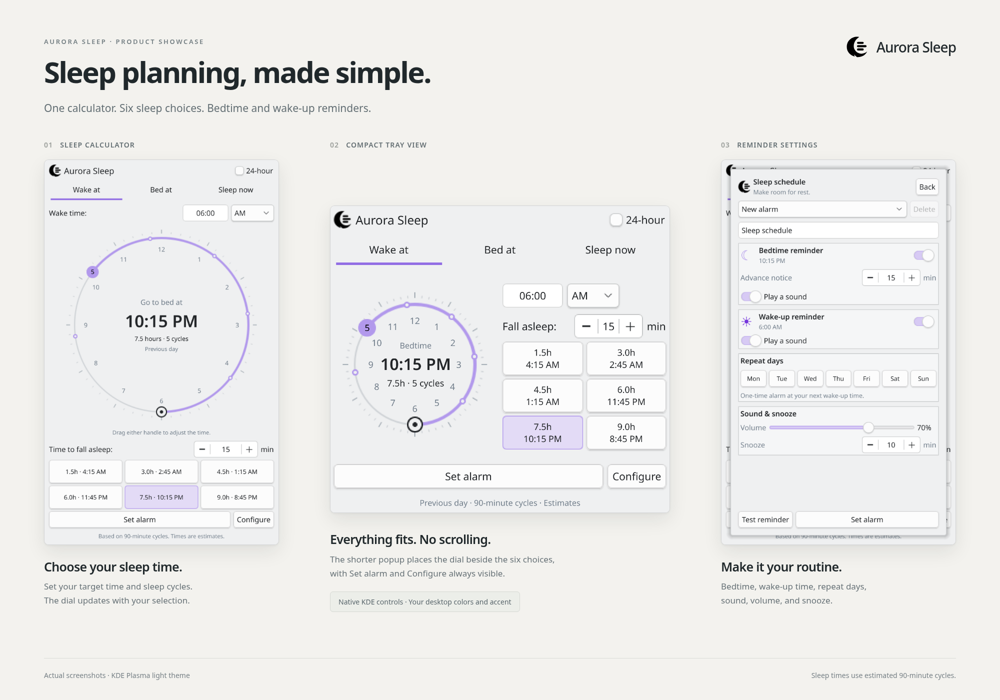

# Aurora

A sleep calculator with configurable bedtime and wake-up reminders. On KDE Plasma 6 it runs as a tray widget using native Plasma controls, so it follows your desktop theme, fonts and accent color. On macOS and Windows it's a standalone tray app; see [tray/README.md](tray/README.md). All versions share the same sleep dial, cycle choices and reminder settings.



These are real Plasma screenshots on the light theme with the system accent. The tray popup uses a compact side-by-side layout so the dial, six cycle choices and alarm controls stay visible without scrolling.

## Use

Choose **Wake at**, **Bed at** or **Sleep now**, then drag the clock handles or edit the time fields and pick one of the six durations under *Time to fall asleep*. The dial and the calculated bed or wake time update as you go. **Set alarm** saves bedtime and wake-up reminders from the current choices without leaving the calculator.

**Configure** opens a scrollable reminder page: alarm name, separate bedtime and wake-up switches and sounds, advance notice, volume, snooze and repeat days. Leave every day off for a one-time alarm at the next wake time. Saved alarms can be loaded, updated, enabled, paused or deleted here, and active reminders get **Snooze** and **Dismiss** in both the notification and the page. **Test reminder** checks that notifications and sound actually reach you.

**Diary** is a calendar of your notes. Pick a day and write in the **Dream**, **Waking** or **Bedtime** section. Entries autosave shortly after you stop typing, and **Save** writes immediately; switching date or section saves first. A dot marks days that have entries, and clearing a section removes only that section. Notes stay on this device in `diary.sqlite3` beside the alarm file and survive widget updates. Each section holds up to 20,000 characters.

The calculator math, alarm form model, diary calendar and diary storage are shared across platforms. KDE uses Plasma controls with a D-Bus adapter; macOS and Windows use the standalone app. The package build fails if copies of those shared files differ.

A repeating Monday wake-up can have its bedtime reminder on Sunday evening. Bedtimes that have already passed are skipped, and if you confirm during the advance-notice window the reminder fires right away. The wake sound repeats for up to five minutes and the notification stays until you acknowledge it.

Reminders run in a user-session service even when the popup is closed. They need a logged-in session and an awake machine; Aurora won't resume your computer. Overdue alarms up to an hour old are delivered after resume, anything older is skipped. Ringing and snoozed reminders survive service restarts, and unacknowledged ones drop out of recovery after 24 hours.

Each sleep cycle counts as 90 minutes, so the times are approximations. Alarm dates use local timezone rules: nonexistent daylight-saving times shift forward, and repeated ones fire once.

## Install or update

Grab the KDE widget, macOS disk image or Windows installer from the [latest release](https://github.com/dralkh/aurora/releases/latest).

Requires Plasma 6, Python 3 with PySide6 (QtCore, QtDBus and QtMultimedia), `notify-send` from libnotify, `qdbus6`, and systemd user services. Bedtime and wake sounds use the installed Ocean or Freedesktop sound theme.

Run in a terminal inside your Plasma desktop:

```sh
./install.sh
systemctl --user restart plasma-plasmashell.service
```

The installer updates the widget and icon, adds the alarm activation files, enables and starts `aurora-alarms.service`, and turns Aurora on in the tray. Restarting the panel reloads the current QML; your other applications stay open. The alarm service starts with future graphical logins and keeps running across panel restarts.

`dist/aurora.plasmoid` installs the widget through Plasma's widget installer. Rebuild it from the package directory with `python3 build-plasmoid.py` after changing the widget, and use `install.sh` when you also want the alarm service set up.

Alarms are stored apart from widget preferences in `${XDG_STATE_HOME:-~/.local/state}/aurora/alarms.json`, so updating the widget keeps your schedules. Manage them through **Configure**, or stop delivery entirely with `systemctl --user disable --now aurora-alarms.service`.

## macOS and Windows

The port lives in `tray/` and keeps the whole app in the tray (the menu bar on macOS). Tagged releases ship a DMG for Apple Silicon and an Inno Setup installer for Windows, plus a fresh `aurora.plasmoid`. Both builds are unsigned, so macOS needs right-click → Open and Windows shows a SmartScreen prompt. [tray/README.md](tray/README.md) covers running from source, packaging, storage locations, uninstalling and tests.

## Validate

```sh
node tests/math.test.cjs
python -m unittest discover -s tests -p 'test_schedule_core.py'
python -m unittest discover -s tests -p 'test_service_logic.py'
QT_QPA_PLATFORM=offscreen QT_QUICK_BACKEND=software /usr/lib/qt6/bin/qmltestrunner -input tests -o -,txt
./tests/test-native-tray.sh
cd tray && QT_QPA_PLATFORM=offscreen QT_QUICK_BACKEND=software python -m unittest discover -s tests -v
```

The native tray test needs Qt 6, the Plasma development headers and an installed Aurora package. It builds a real system tray and checks that its popup opens and closes, including Plasma 6.7's requirement to leave `preferredRepresentation` unset.

For a real D-Bus transport test without notifying your own desktop:

```sh
dbus-run-session -- python tests/test_service_integration.py
```

This drives the real request client and `notify-send` against a simulated notification server (see `tests/requirements.txt`) and needs permission to create a private session bus. The scheduling and service logic tests run without a desktop bus and cover repeat dates, midnight rollover, daylight saving, persistence, snooze, dismiss, failed storage, notification retries and sound state.

Runtime service diagnostics:

```sh
systemctl --user status aurora-alarms.service
journalctl --user -u aurora-alarms.service
```

The package follows the [KDE Plasma widget documentation](https://develop.kde.org/docs/plasma/widget/setup/). Notifications use the [Freedesktop notification protocol](https://specifications.freedesktop.org/notification/latest/protocol.html).

License: MIT.
